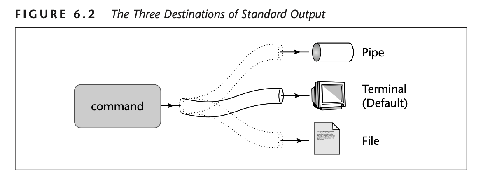

# CSCE215 - Required lab 1

The following points will be discussed in the first required lab.

## SSH Linux Machines

[ssh](https://linux.die.net/man/1/ssh) will allow students to log in into a remote computer and execute commands in the remote machine. In our case, executing the commands in the [Linux Machines in the Swearingen Labs](https://cse.sc.edu/resources/workstations).

For connecting we need the following information:
- Authorized user id (your USCID). Example: *fvilchez*
- Remote computer hostname or IP address. Example: *L-1D43-01.cse.sc.edu*
- Connection port. In our case, port *222*.

Example:

`ssh -p 222 fvilchez@L-1D43-01.cse.sc.edu`

*Pause for questions.*

## Review some commands

- `echo`: Print a message
- `pwd`: Current directory
- `ls`: List files
- `touch`: Create empty file
- `mkdir`: Create directory
- `mv`: Move or rename a file or directory

*Pause for questions.*

- `cd`: Change directory
- `ls -a`: List files, include hidden files
- `.` and `..`: Current and previous directory
- `~`: Reference to your HOME directory

*Pause for questions.*

- `rm`: Delete
- `rm -r`: Delete recursively (used for deleting directories)
- `man`: Open the manual page for a command

*Pause for questions.*

## Redirection with `>` and `>>`

Commands executed show the result in our screen by default (also known as **standard output**). However, we can redirect that result to be displayed somewhere else. Some possible locations where we can redirect the output illustrated bellow (*Taken from DAS page 168*):

`>` and `>>` are used for redirecting the output to a specific file. For example:

`echo "Hello world" > hello.txt`

*Ask what command can be used to view file content. Pause for answers.*

What is the difference?

- `>`: Re-creates the file before writing the output.
- `>>`: Appends the output to the bottom of the file. If file doesn't exist, it will create it.

*Pause for questions.*

## More about `cat` command

[cat](https://www.man7.org/linux/man-pages/man1/cat.1.html) command allows you to concatenate files and print the concatenation in the standard output. You can `cat` at least one file.

`cat file1.txt file2.txt file3.txt` (and many more files)

*Pause for questions.*

## SCP for transferring files

The [scp](https://linux.die.net/man/1/scp) command will allow students to send or pull files from a remote machine, in our case, the [Linux Machines in the Swearingen Labs](https://cse.sc.edu/resources/workstations).

### Pulling files from a remote machine

Additionally to the already required for the `ssh`, we also need the following information for pulling a file:

- *Absolute path* of the file **in the remote machine** that we want to pull. Example: */acct/fvilchez/test.txt*
- *Absolute or Relative path* of the directory **in the local machine** where we want to store the file. Example: *.* (*dot* which refers to the *current directory*)

Since we are pulling a file, the `scp` command needs to be executed from a local terminal, i.e. a terminal without the `ssh` connection.

`scp -P 222 fvilchez@L-1D43-01.cse.sc.edu:/acct/fvilchez/test.txt .`

*Pause for questions.*

<!-- ### Sending a file to a remote machine

Same logic applies but we need to switch the order of the arguments. First we specify the location of the file in the local machine, and after it the location of the file in the remote machine. In the following example, the file *./test.txt* is sent to the home directory of the remote machine.

`scp -P 222 ./test.txt fvilchez@L-1D43-01.cse.sc.edu:~`

*Pause for questions.* -->

## Show Google Form

Complete form for attendance.

<!-- https://docs.google.com/forms/d/e/1FAIpQLSeW5WzcUTO6u-GEYsBwlhnme-6PUTmijWv85Ziu2ZhCVAJepg/viewform -->