# CSCE 215 - Required Lab 2

We will start by doing [ssh](../lab1/README.md#ssh-linux-machines) into the [Linux Machines in the Swearingen Labs](https://cse.sc.edu/resources/workstations).

## Review about commands structure and `man`

So far we have used commands like `ls`, `cd`, `cat`, `echo`, etc. For example:

```
echo 'Hello World!'
cat file.txt
ls
cd /acct/fvilchez
```

But we haven't used that much the different **options** that each of the commands offer (which we will need to use for the next assignment).   

If we remember, the structure of the command goes as follow (Taken from DAS book Pg. 28):

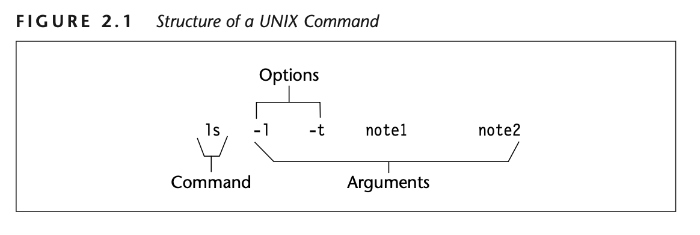

*Ask: How do we know what options we have available, what they do, how to use them? Pause for answers.*

Google may be one of the more straighforward approach to learn how to use a command; however, a more reliable way will be using the `man` command.

Example: `man ls`

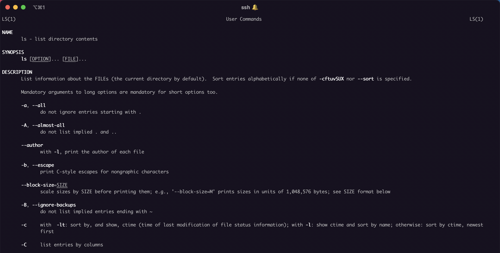

*Pause for questions*

## Breaking down the `man` page

Continuing with the `ls` man page, let's look at the different sections in the `man` page.

### Name section

Just a brief description of the command.


### Synopsis section

The structure of the command. In other words, the order how the arguments of the command should be placed next to it.


A few special symbols we may be wondering what they mean:

* An underlined word like <ins>OPTION</ins>, means that it will be replaced with an appropiate value. For example, the <ins>FILE</ins> word should be replaced with the name of a file. The <ins>OPTION</ins> word should be replaced with an option like `-l`, `-a`, etc. Information about what this values mean is usually included in the next sections of the man page.

*Pause for questions*

* The `...` means that the previous value can be repeated multiple times. In other words, we could use multiple options on the right side of the `ls` command. Also, we could specify multiple files. Notice that, even though we can use multiple <ins>OPTIONS</ins> and <ins>FILES</ins>, the <ins>OPTIONS</ins> will always be before the <ins>FILES</ins> for the `ls` command.

*Pause for questions*

* If a value is in [brackets] it means it is optional. For example, for the `ls` command could be followed by <ins>OPTIONS</ins> or not. Same for <ins>FILES</ins>.

*Pause for questions*

### Description section

A more detailed description of the command.

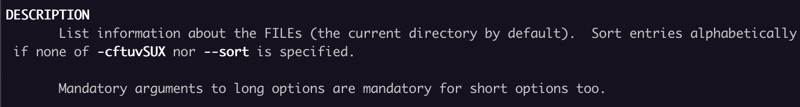

### Options section

Some commands has this section as part of the description section. This is the list of values that we can use in the <ins>OPTION</ins> argument and what each of them do.

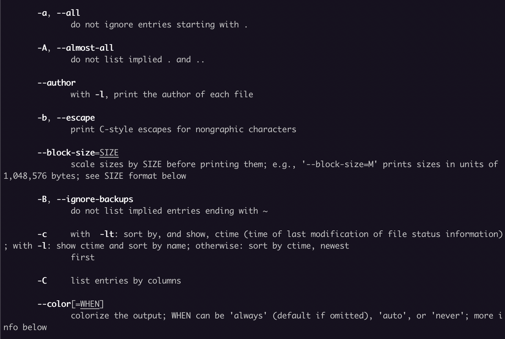

You may notice different type of options:

#### Short option

An option represented by a letter.


Usage examples: 

As we know, we could use the `ls` command with no <ins>FILE</ins> value:
`ls -S`

or with a <ins>FILE</ins> value: `ls -S ~/215`

#### Long option

Some options have a long version of it.

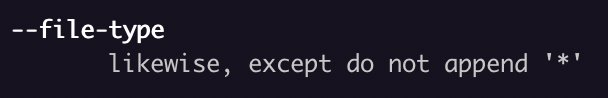

Usage example: `ls --file-type`

As we already know, if you want to use a <ins>FILE</ins>, you just place it next to the option: `ls --file-type ~/215`.

#### Short but also long option available

Some commands also offer a long version of it. Both will give the same results.

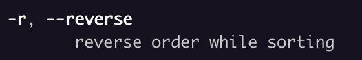

Usage example: `ls -r` or `ls --reverse`. 

*Pause for questions*

#### Options with a value needed next to it

Some options need you to specify a value next to it. 

Taken from the `man tree` page:

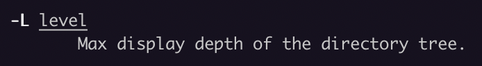

Usage example: `tree -L 2` or `tree -L2`. **Both are valid ways to specify a value for a short option.** The one with an space is more readable so I recommend to use that one.

For an argument needed in a long option, you will have to leave an space or use an equal symbol:

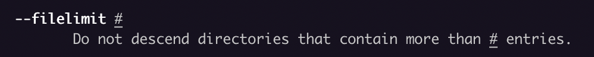

Usage example: `tree --filelimit 3`.

Be aware that some options will request you to specify the value using the `=` symbol. Example taken from `ls` man page:

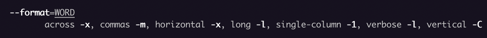

Usage example: `ls --format=commas`

*Pause for questions*

#### Use multiple short options

You can append many of the short options together, so if we want to use the `-a` and `-l` option of the `ls`:

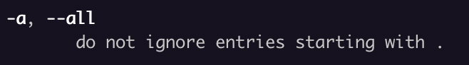


We can either do: `ls -a -l` or `ls -al` or `ls -la`

Remember, if the option you are using **needs** a value next to it, you have to provide the value immediately after it.

*Pause for questions*

## Learning commands with `man`

- `head`: Output first part of files
- `tail`: Output last part of files
- `cut`: Print selected parts of a file
- `paste`: Merge lines of files
- `grep`: Print lines matching a pattern
- `find`: Search for files

## Standard input meets standard output

So far, we have provided a file path to most of our commands to use its content as an input. Example:

`cat file.txt`

However, we can tell a command to use the results from another command as an input, instead of the content of a file. In other words, we can change the *standard input*.

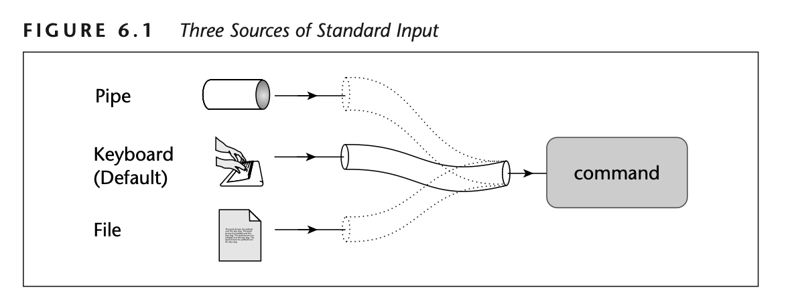

As we remember, commands display their results in what its called the [standard output](../lab1/README.md#redirection-with--and-) and we can redirect them to different targets like a file.

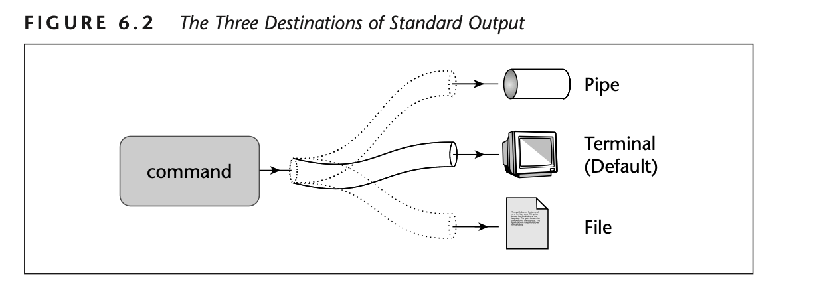

We can also redirect the output to another command by using the pipe symbol `|`.

That way, if we would want to redirect the output of a `command1` to a `command2`, we can do it the following way:

`command1 | command2`

That way, the following commands will get the same results:

`head file.txt`

or

`cat file.txt | head`

Notice that we do not need to specify a <ins>FILE</ins> next to `head` since we want it to use the result from the previous command as an input.

## How to get your file in the Linux Machine

### `wget` option

`wget https://cse.sc.edu/~coleca/Project2.tar.gz`

### `scp` option

`scp -P 222 ~/Downloads/Project2.tar.gz fvilchez@L-1D43-01.cse.sc.edu:~/215/assignment2`