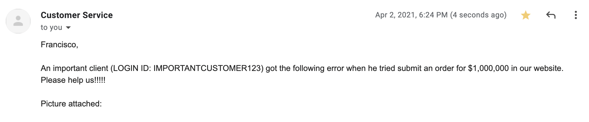
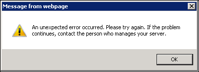

# Lab 4 - When will I use my CSCE215 knowledge?

*You can follow along by downloading this exercise to the linux lab in your home (~) directory!  
`wget http://cse.sc.edu/~fvilchez/215/tons_of_files.tar.gz`*

You may be wondering when will all this knowledge be useful. Well, it will be useful in so many situations (including in your daily life as a computer user), but in this lab, we will give an example from a professional perspective as a Fullstack Software Developer.

## First Act

One normal day at the office, you were happily coding when suddenly you got the following email:

You know that the company's website backend runs in the server *L-1D43-01.cse.sc.edu* (SSH allowed in port 222) and that the logs (files with all the transactions of the website) are located in a directory called something like *logs* somewhere in ~/company/website

*Question: What should you do?*

## Second Act

Get your commands ready

- ssh
- echo
- ls
- pwd
- cd
- tree
- cat
- head
- tail
- find
- grep
- cut
- paste
- sort
- uniq
- tr
- diff

## Third Act

You saved the day. If you feel like giving it a try, feel free to `wget` the files used in this lab from the following url:

`wget http://cse.sc.edu/~fvilchez/215/tons_of_files.tar.gz`

*Additional question: When will I need to use a bash script?*

*Crossover question: When will I use perl? Why? Can I use something else besides perl?*
